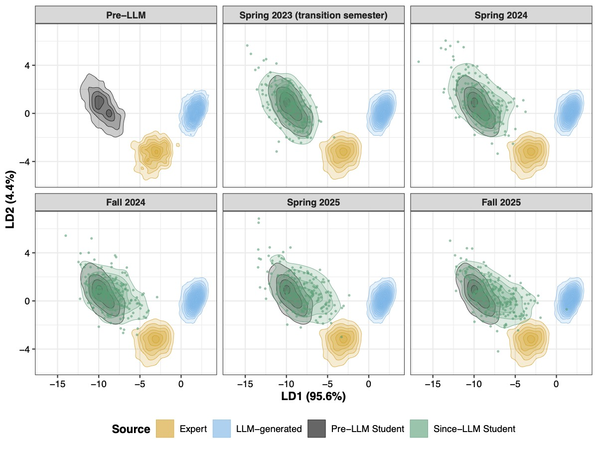

**Overview:** The ability to communicate statistical results to domain experts and stakeholders is an important goal of the undergraduate statistics and data science curriculum. However, as large language models (LLMs) have become more accessible, a major concern is that students are offloading important cognitive tasks to generative AI. Using a corpus of over 1,600 undergraduate students' data analysis reports from 2021 to 2025, we show how students' writing style and verb usage have become more similar to that of LLMs. This shift is most pronounced in the first and fifth quintiles of students' reports, which roughly map onto the introduction and conclusion sections, respectively. At the same time, we demonstrate that students' writing style has become more similar to that of statistics experts with the addition of LLMs. We end by discussing the implications of our findings for statistics and data science educators. In particular, we propose alternative modes of assessment that still emphasize statistical thinking, such as targeted writing assignments for structuring a report introduction.

**Colando, S.**\*, Franke, E.\*, Weinberg, G., and Reinhart, A. [Analyzing students’ statistics writing before and after the emergence of large language models](https://doi.org/10.48550/arXiv.2606.22735), submitted, 2026.

Versions of this work have also been presented at various statistics education conferences:

- USCOTS 2025 Research Satellite as a [poster](https://www.causeweb.org/cause/uscots/uscots25/research/posters/8)

- ECOTS 2026 as a [breakout session](https://www.causeweb.org/cause/ecots/ecots26/program/breakouts/7D)

- ICOTS 12 as both a [main topic session talk](https://virtual.oxfordabstracts.com/event/73693/submission/334) and a [contributed session talk](https://virtual.oxfordabstracts.com/event/73693/submission/377)

\* denotes equal contribution.

